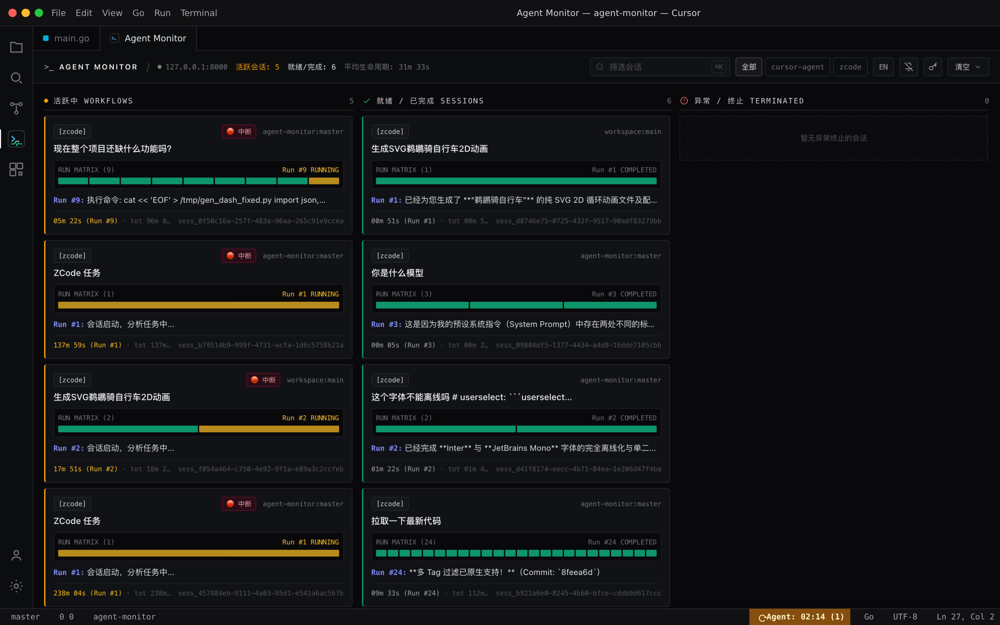
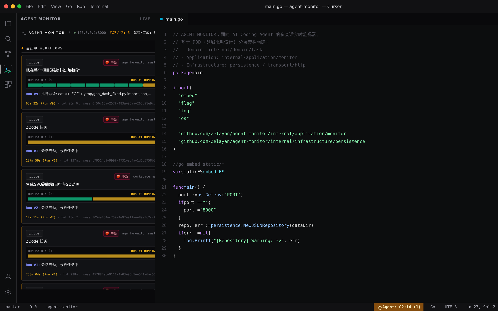
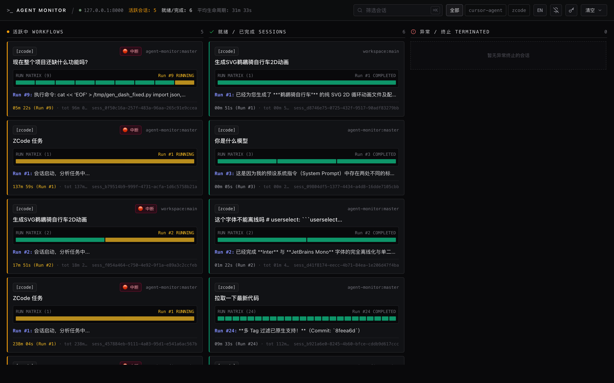
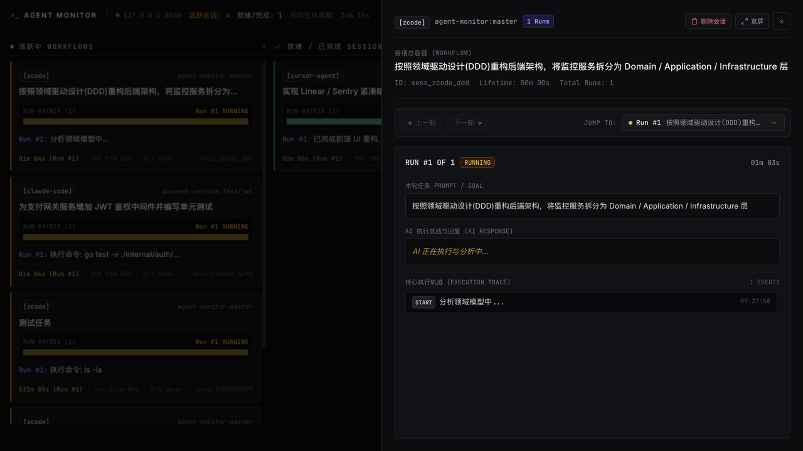
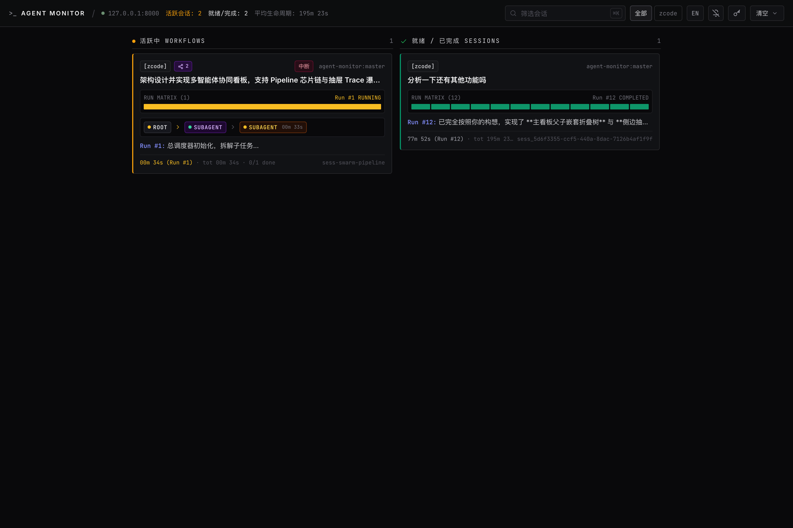
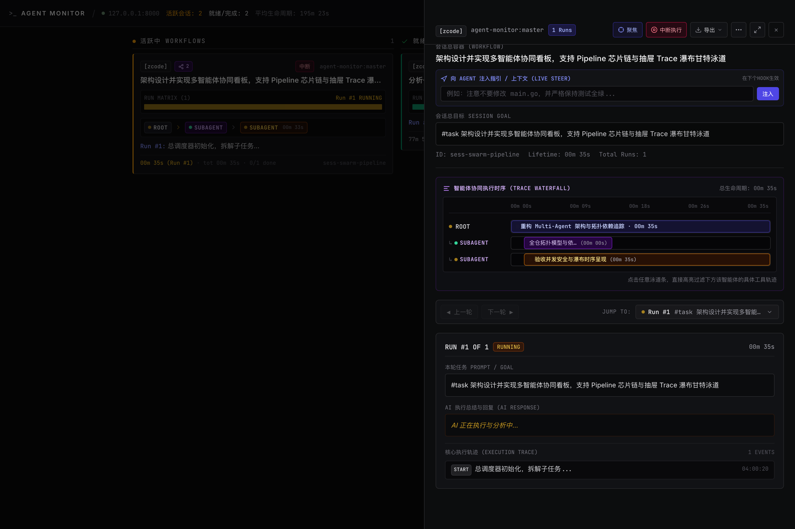

<div align="center">

[English](README.en.md) | [简体中文](README.md)

# AGENT MONITOR

**A real-time flight dashboard for AI Coding Agents**

[](https://github.com/Zelayan/agent-monitor/releases)
[](https://go.dev/)
[](LICENSE)
[](#-features)
[](#-features)
[](https://github.com/Zelayan/agent-monitor/actions)

<p align="center">
  First-class support for <b>Cursor</b>, <b>ZCode</b>, and <b>Codex (CLI / Desktop)</b>, covering the full lifecycle of AI coding assistants (other Agents are still being adapted).<br/>
  Built with the Go standard library: a single zero-dependency binary, nanosecond Fail-Safe intercepts, 100% offline embed, and a PWA desktop window.
</p>

[Quick Start](#-quick-start-30-seconds) • [Features](#-features) • [Let AI wire it up](#-let-ai-wire-it-up-for-you) • [Installation](docs/INSTALLATION.md) • [Agent Integration](docs/AGENT_INTEGRATION.md) • [Parallel Agents](docs/PARALLEL_AGENTS.en.md)

</div>

---

<details open>
  <summary><b>Preview (click to collapse / expand)</b></summary>
  <br/>
  <p align="center"><b>Cursor extension</b>: activity-bar / editor-embedded dashboard, status-bar stopwatch</p>
  <p align="center">
    
  </p>
  <p align="center">
    
  </p>
  <p align="center"><b>Web dashboard</b>: browser / PWA overview and multi-turn timeline drawer</p>
  <p align="center">
    
  </p>
  <p align="center">
    
  </p>
  <p align="center"><b>Multi-Agent Topology</b>: embedded Agent Pipeline strip on board and Trace Waterfall swimlanes in drawer</p>
  <p align="center">
    
  </p>
  <p align="center">
    
  </p>
</details>

---

## Quick Start (30 seconds)

### 1. One-step install

#### Option A: Cursor extension (recommended; zero-config inside the IDE)
- Download the latest `agent-monitor-cursor-*.vsix` from [Releases](https://github.com/Zelayan/agent-monitor/releases);
- In Cursor press `⌘⇧P` (Windows/Linux: `Ctrl+Shift+P`) and run:
  ```text
  Extensions: Install from VSIX...
  ```
- Or from a terminal:
  ```bash
  cursor --install-extension dist/agent-monitor-cursor-1.0.1.vsix
  ```
> **Cursor extension is ready out of the box**: it starts the backend daemon, one-click workspace `.cursor/hooks.json`, a status-bar stopwatch, and an activity-bar / editor-embedded dashboard.

#### Option B: System CLI / standalone service
```bash
curl -fsSL https://raw.githubusercontent.com/Zelayan/agent-monitor/main/install.sh | bash
```
> Linux registers a systemd user service; macOS and Windows symlink into PATH. More options (Docker, air-gapped intranet, Go install, from source) are in the **[full installation guide](docs/INSTALLATION.md)**.

### 2. Open the dashboard
In a browser: **[http://127.0.0.1:8000/](http://127.0.0.1:8000/)**
> **PWA desktop app**: in Chrome / Edge click **Install** in the address bar to run the dashboard as a borderless desktop app, pinned to the Dock / taskbar, with its own shortcut.

---

## Features

- **Zero Dependencies**: pure Go standard library, a single static binary. No Node.js, Python, or external database.
- **Fail-Safe intercepts**: `agent-reporter` always allows the Agent to continue (`continue: true`) on any fault, timeout, or outage, and **never blocks day-to-day coding**.
- **100% offline embed**: `go:embed` ships the frontend, offline CSS/JS runtime, and local fonts inside the binary for intranet or disconnected hosts.
- **PWA desktop app**: Web App Manifest and Service Worker, installable as a frameless dark client.
- **Web Notifications**: native OS toasts when a task completes or fails; click to focus and open that task.
- **Per-project Key namespaces and auth**: optional per-project keys (`AGENT_MONITOR_API_KEYS`) plus a global admin Master Key, isolating data and operations across projects.
- **Multi-Turn Timeline**: aggregates many turns in one session, isolates duration per run, and reconstructs the tool tree (Bash, Edit, Read, and so on).
- **Short session titles (optional LLM)**: cards show a cleaned short title; with an OpenAI-compatible endpoint each run can summarize asynchronously. Session `goalSummary` refreshes every N completed runs (default 3, `AGENT_MONITOR_LLM_GOAL_EVERY_N`); the original `rootGoal` is never rewritten. Unset means no network.
- **Deep Cursor Native Integration (Live Steer & Follow-up Bridge)**: a bidirectional `postMessage` bridge connects the Cursor extension and the webview dashboard. The collaboration input automatically adapts to **Live Steer** when running and **Follow-up (Next Run)** when completed, with automatic clipboard copy fallback in standalone browsers.
- **Tick Sparkline Matrix**: compact micro-sparklines embedded in cards visually map running, completed, and failed status across dozens of interaction turns at a glance.
- **Multi-Agent sniffing**: first-class lifecycle Hooks for **Cursor**, **ZCode**, and **Codex (CLI / Desktop)**; other Agents (Claude Code, Aider, and more) are still being adapted.

---

## Let AI wire it up for you

In any AI-driven workspace (Cursor / ZCode / Codex), send the following so the Agent can configure Hooks from [llms.txt](llms.txt):

```text
Please follow the AGENT MONITOR setup rules, read https://raw.githubusercontent.com/Zelayan/agent-monitor/main/llms.txt,
check whether agent-reporter is installed, and configure lifecycle Hook reporting for this project or the user environment.
```

---

## Integration matrix

Hook mechanics, environment variables, and tuning: **[Agent Integration Manual](docs/AGENT_INTEGRATION.md)**.

| Agent | Status | Mechanism | Config path | Minimal example |
| :--- | :--- | :--- | :--- | :--- |
| **Cursor** | Production ready | Cursor Hooks | `.cursor/hooks.json` | `{"command": "agent-reporter"}` |
| **ZCode** | Production ready | Extension Hook | `.zcode/hooks.json` | See example below |
| **Codex CLI / Desktop** | Production ready | Codex Hooks / Wrapper | `.codex/hooks.json` | `{"command": "agent-reporter"}` |
| **Claude Code** | Pending | Session Config | `~/.claude/config.json` | Planned |
| **Aider** | Pending | Terminal notify | `.aider.conf.yml` | Planned |
| **Windsurf / Trae** | Pending | Extension Hook | - | Planned |
| **Custom scripts** | REST API | HTTP POST | Any script or automation | `POST http://127.0.0.1:8000/api/event` |

<details>
<summary><b>ZCode / Cursor / Codex config examples</b></summary>

#### ZCode (`.zcode/hooks.json`)
```json
{
  "hooks": {
    "PostToolUse": [{ "command": "agent-reporter" }],
    "PostToolUseFailure": [{ "command": "agent-reporter" }],
    "SessionStart": [{ "command": "agent-reporter" }],
    "UserPromptSubmit": [{ "command": "agent-reporter" }],
    "Stop": [{ "command": "agent-reporter" }]
  }
}
```

#### Cursor (`.cursor/hooks.json`)
```json
{
  "version": 1,
  "hooks": {
    "beforeSubmitPrompt": [{ "command": "agent-reporter" }],
    "afterAgentResponse": [{ "command": "agent-reporter" }],
    "stop": [{ "command": "agent-reporter" }]
  }
}
```

#### Codex (`.codex/hooks.json`)
```json
{
  "version": 1,
  "hooks": {
    "beforeSubmitPrompt": [{ "command": "agent-reporter" }],
    "afterAgentResponse": [{ "command": "agent-reporter" }],
    "stop": [{ "command": "agent-reporter" }]
  }
}
```
</details>

---

## Global and project config (default filter: `#task`)

Out of the box the system **only records prompts that contain `#task`**, and ignores casual chat (once the first turn hits `#task`, later follow-ups in that session are tracked without repeating the tag). To record **everything** for a core project (no tag required):

- **Enable full capture for this project** (writes `.agent-monitor.json` in the repo root, overriding global):
  ```bash
  agent-reporter init-config --local --tag "" # force full capture in this project, no #task needed
  ```
- **Initialize global config** (optional API Key):
  ```bash
  agent-reporter init-config --tag "#task" --api-key "your-secret-token"
  ```
- **Show the effective config**:
  ```bash
  agent-reporter config
  ```

Precedence is nearest-wins: **CLI flags > environment variables (`AGENT_MONITOR_REQUIRE_TAG`, and so on) > project config (`.agent-monitor.json`) > global config (`~/.agent-monitor/config.json`)**. Details: **[Agent Integration Manual](docs/AGENT_INTEGRATION.md)**.

> **💡 Keyword Untracking & Deletion**: To stop tracking and remove a session from the board, include `#drop` or `#untrack` in your prompt. The reporter will automatically issue a delete request to Monitor and silence further events.

---

## Automated AI Code Review (GitHub Actions)

The repository includes an automated GitHub Actions AI Code Review workflow. On every Pull Request or push, it automatically reviews diffs against the project's DDD architecture, race-free concurrency rules, fail-safe hook constraints, and I18N standards.

### Configuration:
Create an Environment named `ai-review` in your GitHub repository, and configure under its **Environment secrets** (or repository-wide **Repository secrets**):
- `OPENAI_API_KEY` (Required): OpenAI API Key or compatible provider token.
- `OPENAI_BASE_URL` (Optional): Default `https://api.openai.com/v1` (supports custom proxies or reverse proxies).
- `OPENAI_MODEL` (Optional): Default `gpt-4o` (e.g. `deepseek-chat`, `gpt-4o-mini`).

---

## 🛡️ Remote Deployment & Security (API Key Auth)

Agent Monitor provides cryptographic-grade access control (using Go's `crypto/subtle.ConstantTimeCompare` against timing attacks) out of the box, supporting both single-shared keys and multi-tenant project isolation:

### 1. Server Authentication Environment Variables
- **Single Shared Key**:
  ```bash
  export AGENT_MONITOR_API_KEY="your-strong-secret-token"
  agent-monitor -port 8000
  ```
- **Multi-Tenant / Multi-Project Isolation + Master Key**:
  ```bash
  # Format: projA=token1,projB=token2
  export AGENT_MONITOR_API_KEYS="projA=token_alpha,projB=token_beta"
  export AGENT_MONITOR_MASTER_KEY="master-super-secret-key"
  agent-monitor -port 8000
  ```

### 2. Client and Dashboard Integration
- **Reporter Ingestion**: Configure `"api_key": "your-token"` in `~/.agent-monitor.json`, or pass `agent-reporter --api-key "your-token"`.
- **Web Dashboard**: An authentication modal automatically prompts on 401 Unauthorized responses, or configure keys anytime via the **🔑 Auth Settings** button in the header. Token inputs are persisted in local browser storage.
- **Reverse Proxy Best Practices**: When deploying to public servers, reverse proxy behind Nginx or Caddy with HTTPS enabled and ensure `proxy_buffering off;` is set for instant SSE updates. Full guide: **[📖 Remote Deployment & PWA / HTTPS Guide (REMOTE_DEPLOYMENT.en.md)](docs/REMOTE_DEPLOYMENT.en.md)**.

---

## HTTP API

All protected endpoints accept authentication through `Authorization: Bearer <key>`, `X-API-Key: <key>`, or URL Query parameter `?token=<key>`.

| Method | Endpoint | Auth Required | Purpose | Notes |
| :--- | :--- | :--- | :--- | :--- |
| `GET` | `/api/version` | Public | Version & Build Metadata | Returns current version, commit, build timestamp for hot-reload and updates |
| `POST` | `/api/event` | Required (if configured) | Hook event ingest | Ingests lifecycle events and tool execution spans from agents |
| `GET` | `/api/stream` | Required (if configured) | SSE live stream | Server-Sent Events connection (`?token=<key>` supported) |
| `GET` | `/api/tasks` | Required (if configured) | List all sessions | Returns cloned aggregated sessions filtered by project scope |
| `GET` | `/api/tasks/{id}` | Required (if configured) | Session details | Retrieves full multi-turn timeline, run matrix, and trace spans |
| `POST` | `/api/tasks/{id}/abort` | Required (if configured) | Abort active execution | Signals cancellation and safely terminates agent process tree |
| `DELETE` | `/api/tasks` | Required (if configured) | Clear sessions | Batch deletes with `?all=true` (current scope) or payload `ids` |
| `GET` | `/api/metrics` | Required (if configured) | Operational metrics | Exports active connections, throughput, and dropped events |
| `GET` | `/healthz` | Public | Liveness probe | Instant 200 OK indicating the process is alive |
| `GET` | `/readyz` | Public | Readiness probe | Checks storage availability and ingestion queue readiness |
| `GET` | `/manifest.json` | Public | PWA manifest | App metadata and offline desktop icon descriptions |

---

## Docs

- **[Installation (INSTALLATION.md)](docs/INSTALLATION.md)**: systemd, air-gapped packages, Docker, and builds.
- **[Remote Deployment & HTTPS (REMOTE_DEPLOYMENT.en.md)](docs/REMOTE_DEPLOYMENT.en.md)**: reverse proxies, TLS certs, Chrome bypass flags, and multi-tenant security.
- **[Agent Integration (AGENT_INTEGRATION.md)](docs/AGENT_INTEGRATION.md)**: Agent sniffing, Hook protocol, and parameters.
- **[Parallel Agents (PARALLEL_AGENTS.en.md)](docs/PARALLEL_AGENTS.en.md)**: concurrent Cursor Agents on isolated GitHub `feat/` / `fix/` branches via worktrees or Cloud Agents.
- **[Complete Development Roadmap (DEVELOPMENT_ROADMAP.en.md)](docs/DEVELOPMENT_ROADMAP.en.md)**: current capability baseline, correctness and security gaps, phased features, migrations, tests, acceptance criteria, and PR boundaries.
- **[LLM index (llms.txt)](llms.txt)**: high-density context for models and Coding Agents.
- **[Architecture and collaboration (AGENTS.md)](AGENTS.md)**: DDD layering, race-free locks, and Git rules.

---

## License

[MIT License](LICENSE). Issues and Pull Requests are welcome.
