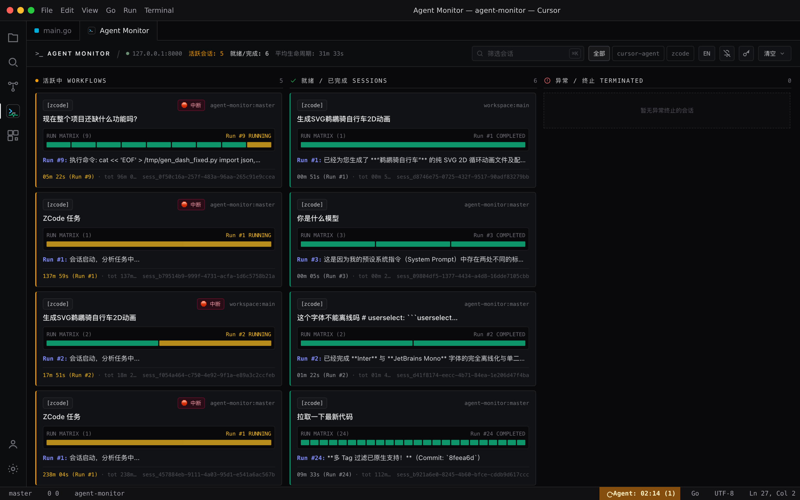
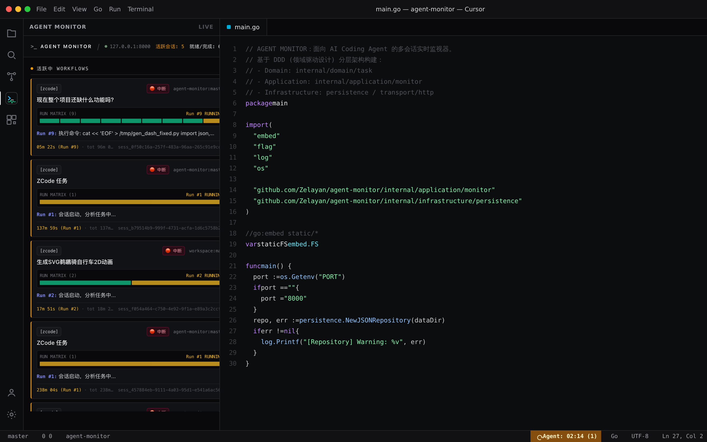
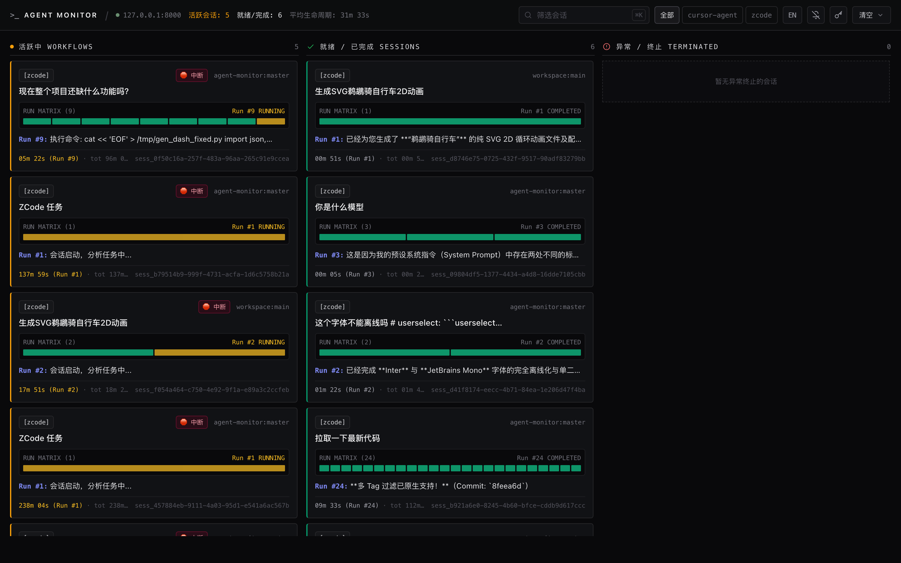
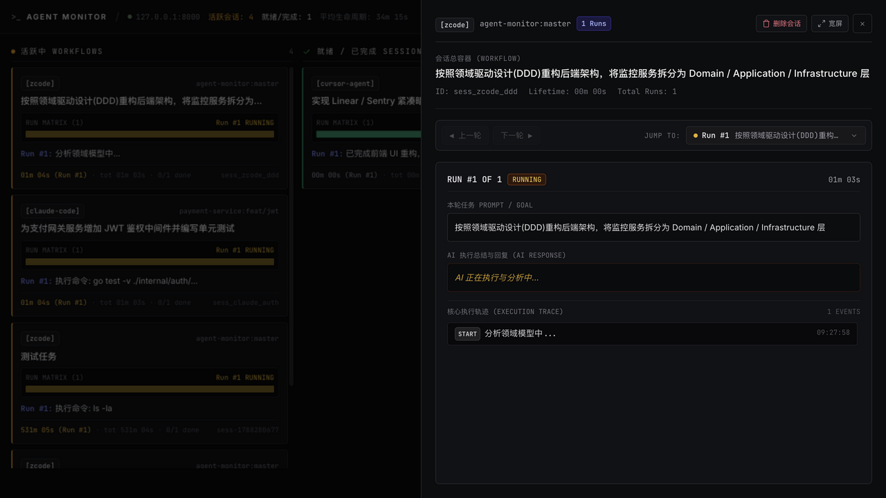
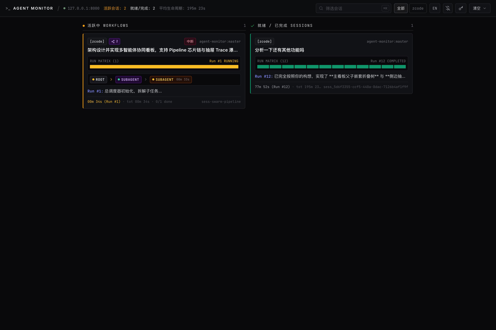
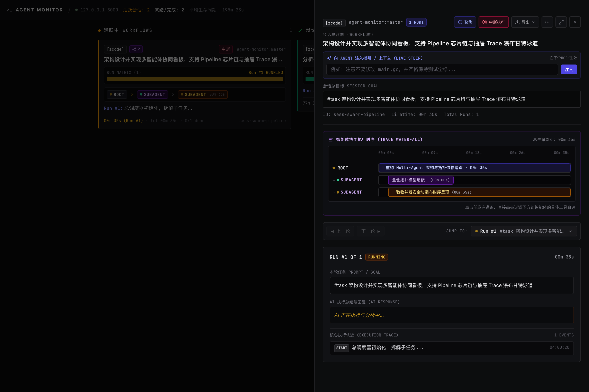

<div align="center">

[English](README.en.md) | [简体中文](README.md)

# AGENT MONITOR

**面向 AI Coding Agent 的专业级实时飞行仪表盘**

[](https://github.com/Zelayan/agent-monitor/releases)
[](https://go.dev/)
[](LICENSE)
[](#-核心特性)
[](#-核心特性)
[](https://github.com/Zelayan/agent-monitor/actions)

<p align="center">
  首发深度适配 <b>Cursor</b>、<b>ZCode</b> 与 <b>Codex (CLI / Desktop)</b>，统一监控 AI 编程助手的执行全生命周期（其他 Agent 待适配中）。<br/>
  基于 Go 标准库构建，0 外部依赖单二进制，纳秒级 Fail-Safe 拦截，100% 离线内嵌运行，支持 PWA 原生桌面窗口。
</p>

[⚡️ 快速开始](#️-快速开始-30-秒上手) • [✨ 核心特性](#-核心特性) • [🤖 让 AI 自动接入](#-让-ai-自动为你接入) • [📖 安装指南](docs/INSTALLATION.md) • [🔌 Agent 集成手册](docs/AGENT_INTEGRATION.md) • [并行 Agent](docs/PARALLEL_AGENTS.md)

</div>

---

<details open>
  <summary><b>🖼️ 视觉预览（点击折叠 / 展开）</b></summary>
  <br/>
  <p align="center"><b>Cursor 插件</b>：活动栏 / 编辑器内嵌看板，底部状态栏实时秒表</p>
  <p align="center">
    
  </p>
  <p align="center">
    
  </p>
  <p align="center"><b>Web 看板</b>：浏览器 / PWA 全览与多轮时间线抽屉</p>
  <p align="center">
    
  </p>
  <p align="center">
    
  </p>
  <p align="center"><b>Multi-Agent 拓扑协同</b>：主看板内嵌 Agent Pipeline 芯片链与抽屉 Trace 瀑布甘特泳道图</p>
  <p align="center">
    
  </p>
  <p align="center">
    
  </p>
</details>

---

## ⚡️ 快速开始 (30 秒上手)

### 1. 一键安装

#### 方式 A：安装 Cursor 专属扩展（最推荐，零配置在 IDE 内开箱即用）
- 从 [Releases](https://github.com/Zelayan/agent-monitor/releases) 下载最新的 `agent-monitor-cursor-*.vsix`；
- 在 Cursor 中按 `⌘⇧P`（Windows/Linux 为 `Ctrl+Shift+P`），输入并执行：
  ```text
  Extensions: Install from VSIX...
  ```
- 或通过终端执行：
  ```bash
  cursor --install-extension dist/agent-monitor-cursor-1.0.1.vsix
  ```
> 💡 **Cursor 插件开箱即用**：自带后台守护进程自启、工作区 `.cursor/hooks.json` 一键配置、底部状态栏秒表与左侧活动栏 / 主编辑区内嵌看板！

#### 方式 B：系统级 CLI / 独立服务安装
```bash
curl -fsSL https://raw.githubusercontent.com/Zelayan/agent-monitor/main/install.sh | bash
```
> Linux 自动注册 systemd 用户服务守护；macOS 与 Windows 自动软链至 PATH。更多安装方式（Docker、离线内网、Go Install、源码编译）详见 **[📖 完整安装与部署指南](docs/INSTALLATION.md)**。

### 2. 访问看板
打开浏览器访问：**[http://127.0.0.1:8000/](http://127.0.0.1:8000/)**
> 💡 **PWA 原生桌面体验**：在 Chrome / Edge 地址栏右侧点击 **「安装」**，即可将看板作为无边框独立桌面 App 运行，常驻 Dock / 任务栏，支持快捷键独立切换。

---

## ✨ 核心特性

- **🚀 极致轻量与零依赖（Zero Dependencies）**：纯 Go 标准库实现，单静态二进制部署，无需 Node.js、Python 或外部数据库。
- **🛡️ 毫秒级 Fail-Safe 拦截铁律**：`agent-reporter` 拦截器遇任何故障、网络超时或宕机均在毫秒内静默放行（`continue: true`），**绝不阻断日常编码**。
- **🌐 100% 离线内嵌**：通过 `go:embed` 将前端页面、离线样式、JS 运行时与本地字体完整编译进二进制，内网或脱机环境开箱即用。
- **🖥️ PWA 桌面独立应用**：内置 Web App Manifest 与 Service Worker，支持桌面安装为无浏览器边框的沉浸式黑底客户端。
- **🔔 桌面原生通知（Web Notifications）**：任务从运行到完成或异常中断时向操作系统发送原生桌面弹窗，点击即可快速唤起并展开该任务详情。
- **🔒 多项目 Key 命名空间隔离与鉴权**：支持配置多项目独立 Key (`AGENT_MONITOR_API_KEYS`) 与全局管理员 `Master Key`，实现项目间数据流与操作权限的严格物理隔离。
- **⏱️ 多轮 Run 会话矩阵（Multi-Turn Timeline）**：自动聚合单会话内的多轮交互，按轮次隔离耗时，清晰还原工具调用（Bash、Edit、Read 等）的完整树状轨迹。
- **🧾 会话短标题（可选 LLM 总结）**：卡片默认展示清洗后的短标题；配置 OpenAI 兼容接口后，每轮收口会异步总结多轮内容并刷新容器标题。会话总目标 `goalSummary` 按可配置间隔（默认每 3 轮，`AGENT_MONITOR_LLM_GOAL_EVERY_N`）刷新，**首轮原文 `rootGoal` 不变**；未配置时零网络。
- **🎯 Cursor 深度原生联动（Live Steer & Follow-up Bridge）**：Cursor 插件与内嵌 Webview 之间通过 `postMessage` 搭建双向通信网桥；底部协同输入区支持运行态实时指引（Live Steer）与完结态追问（Follow-up / Next Run），外部独立浏览器环境自动优雅降级为剪贴板。
- **📊 轮次刻度条（Tick Sparkline Matrix）**：任务卡片内嵌高密度微型刻度条，实时映射多轮交互（Run Matrix）的运行中、成功或中断分布，单卡清晰掌控数十轮执行全貌。
- **🔍 智能多 Agent 动态嗅探**：首发深度适配 **Cursor**、**ZCode** 与 **Codex (CLI / Desktop)** 全生命周期 Hook，自动推断运行环境；其他 Agent（Claude Code、Aider 等）持续待适配中。

---

## 🤖 让 AI 自动为你接入

在任何由 AI 驱动的项目工作区（如 Cursor / ZCode / Codex）中，直接发送以下指令，AI 即可根据本项目预置的 [llms.txt](llms.txt) 和配置指南自动完成 Hook 接入：

```text
请参考当前系统中的 AGENT MONITOR 配置规范，阅读 https://raw.githubusercontent.com/Zelayan/agent-monitor/main/llms.txt，
检查本机是否已安装 agent-reporter，并为当前项目或全局环境配置好生命周期 Hook 上报。
```

---

## 🔌 接入支持一览

详细的 Hook 机制、环境变量支持与参数调优详见 **[🔌 Agent 集成与配置手册](docs/AGENT_INTEGRATION.md)**。

| Agent | 适配状态 | 接入机制 | 配置文件路径 | 最小配置示例 |
| :--- | :--- | :--- | :--- | :--- |
| **Cursor** | ✅ **已正式适配** | Cursor Hooks | `.cursor/hooks.json` | `{"command": "agent-reporter"}` |
| **ZCode** | ✅ **已正式适配** | 扩展 Hook | `.zcode/hooks.json` | 见下方配置示例 |
| **Codex CLI / Desktop** | ✅ **已正式适配** | Codex Hooks / Wrapper | `.codex/hooks.json` | `{"command": "agent-reporter"}` |
| **Claude Code** | ⏳ *待适配* | Session Config | `~/.claude/config.json` | 规划待适配中 |
| **Aider** | ⏳ *待适配* | 终端通知 | `.aider.conf.yml` | 规划待适配中 |
| **Windsurf / Trae** | ⏳ *待适配* | 扩展 Hook | - | 规划待适配中 |
| **自定义脚本** | 🛠️ *REST API* | HTTP POST | 任何脚本或自动化 | `POST http://127.0.0.1:8000/api/event` |

<details>
<summary><b>展开查看 ZCode / Cursor / Codex 配置示例</b></summary>

#### ZCode 配置 (`.zcode/hooks.json`)
```json
{
  "hooks": {
    "PostToolUse": [{ "command": "agent-reporter" }],
    "PostToolUseFailure": [{ "command": "agent-reporter" }],
    "SessionStart": [{ "command": "agent-reporter" }],
    "UserPromptSubmit": [{ "command": "agent-reporter" }],
    "Stop": [{ "command": "agent-reporter" }]
  }
}
```

#### Cursor 配置 (`.cursor/hooks.json`)
```json
{
  "version": 1,
  "hooks": {
    "beforeSubmitPrompt": [{ "command": "agent-reporter" }],
    "afterAgentResponse": [{ "command": "agent-reporter" }],
    "stop": [{ "command": "agent-reporter" }]
  }
}
```

#### Codex 配置 (`.codex/hooks.json`)
```json
{
  "version": 1,
  "hooks": {
    "beforeSubmitPrompt": [{ "command": "agent-reporter" }],
    "afterAgentResponse": [{ "command": "agent-reporter" }],
    "stop": [{ "command": "agent-reporter" }]
  }
}
```
</details>

---

## 🎯 全局与项目级配置（开箱即用默认过滤 `#task`）

系统开箱即用**默认只记录带有 `#task` 的任务 Prompt**，自动忽略日常随意闲聊（一旦首轮命中 `#task`，后续多轮追问全程自动追踪，无需重复打标签）。如果希望针对**核心业务项目开启全量追踪（不打标签也记录）**：

- **针对当前项目开启全量监控**（在当前项目根目录生成 `.agent-monitor.json` 覆盖全局）：
  ```bash
  agent-reporter init-config --local --tag "" # 当前项目强制全量监控，无需打 #task
  ```
- **初始化全局配置（可同时配置 API Key）**：
  ```bash
  agent-reporter init-config --tag "#task" --api-key "your-secret-token"
  ```
- **查看当前生效配置**：
  ```bash
  agent-reporter config
  ```

配置优先级遵循就近原则：**命令行参数 > 环境变量 (`AGENT_MONITOR_REQUIRE_TAG` 等) > 项目配置 (`.agent-monitor.json`) > 全局配置 (`~/.agent-monitor/config.json`)**。详细说明见 **[🔌 Agent 集成与配置手册](docs/AGENT_INTEGRATION.md)**。

> **💡 关键字快速取关与删除**：如果不想继续追踪某个会话，可在提问中包含 `#drop` 或 `#untrack`，系统将自动触发 Monitor 移除该记录并清理本地状态。

---

## 🤖 自动化 AI Code Review (GitHub Actions)

项目内置了基于 GitHub Actions 的自动化 AI Code Review 机器人，在每次提 PR 或更新代码时自动对 Diff 进行 DDD 架构分层、并发竞态（Data Race）、Fail-Safe 铁律及双语国际化（I18N）的针对性审查。

### 配置方法（仓库管理员）：
在 GitHub 仓库中创建名为 `ai-review` 的 Environment，并在其 **Environment secrets**（或仓库全局 **Repository secrets**）中添加：
- `OPENAI_API_KEY`（必需）：OpenAI API Key 或第三方中转 Key。
- `OPENAI_BASE_URL`（可选）：默认 `https://api.openai.com/v1`（可填国内镜像或中转代理）。
- `OPENAI_MODEL`（可选）：默认 `gpt-4o`（亦可配置 `deepseek-chat`、`gpt-4o-mini` 等）。

---

## 📡 HTTP API 概览

| Method | Endpoint | 用途 | 说明 |
| :--- | :--- | :--- | :--- |
| `POST` | `/api/event` | Hook 事件上报 | 接收各 Agent 触发的生命周期事件（支持 `Authorization: Bearer <key>`） |
| `GET` | `/api/stream` | SSE 实时事件流 | Server-Sent Events（支持 `?token=<key>` 或 Header 鉴权） |
| `GET` | `/api/tasks` | 获取所有任务 | 返回当前内存/磁盘上的全量会话聚合数据 |
| `DELETE` | `/api/tasks` | 清空历史任务 | 支持 `?all=true` 或指定 `ids` 列表批量删除 |
| `GET` | `/manifest.json` | PWA 清单 | 提供应用元数据与离线图标描述 |

---

## 📚 文档导航

- **[📖 安装与部署指南 (INSTALLATION.md)](docs/INSTALLATION.md)**：包含 systemd 守护管理、内网离线包、Docker 镜像与编译构建全指南。
- **[🔌 Agent 集成手册 (AGENT_INTEGRATION.md)](docs/AGENT_INTEGRATION.md)**：各 Agent 嗅探规则、Hook 协议定义与参数说明。
- **[并行 Agent (PARALLEL_AGENTS.md)](docs/PARALLEL_AGENTS.md)**：同一 GitHub 仓库上多 Cursor Agent 用 worktree / Cloud 分分支并发开发。
- **[🤖 LLM 索引接口 (llms.txt)](llms.txt)**：专为大模型与 Coding Agent 设计的高密度上下文接入入口。
- **[📐 架构与协作规范 (AGENTS.md)](AGENTS.md)**：DDD 分层规范、并发安全读写锁机制与 Git 铁律。

---

## 📄 开源协议

本项目基于 [MIT License](LICENSE) 开源。欢迎提 Issue 与 Pull Request！
